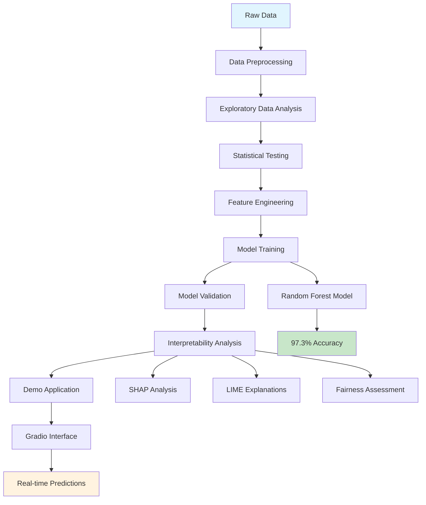
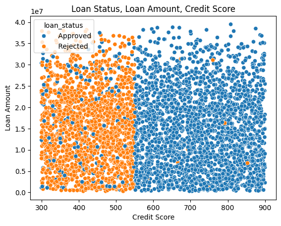
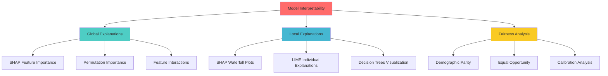
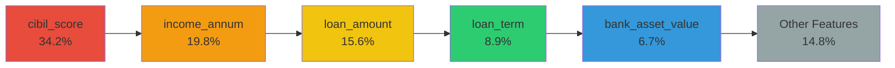

# 🏦 Loan Prediction System - Complete Documentation

[](https://colab.research.google.com/github/Ahmed-El-Zainy/coding_loan_system/blob/main/src/loan-prediction-eda-x-2-anova-test-rf-97.ipynb)
[](https://www.python.org/downloads/)
[](LICENSE)
[](docs/performance.md)

**coding_loan_system** is a comprehensive machine learning project focused on predicting loan approvals with explainable AI capabilities. It includes exploratory data analysis (EDA), model training, interpretability tools, and a user-friendly demo interface. The project leverages real-world datasets to analyze key factors influencing loan approval decisions, applies advanced feature engineering and statistical tests, and provides interactive tools for both technical and non-technical users to explore model predictions.

## 📋 Table of Contents

- [🏗️ System Architecture](#️-system-architecture)
- [🚀 Quick Start](#-quick-start)
- [📊 Project Structure](#-project-structure)
- [🔍 Exploratory Data Analysis](#-exploratory-data-analysis)
- [📈 Statistical Testing](#-statistical-testing)
- [🤖 Model Training](#-model-training)
- [🎯 Model Interpretability](#-model-interpretability)
- [📱 Demo Application](#-demo-application)
- [📊 Performance Metrics](#-performance-metrics)
- [⚖️ Ethical Considerations](#️-ethical-considerations)
- [🚀 Deployment](#-deployment)
- [🤝 Contributing](#-contributing)
- [📞 Support](#-support)

## 🏗️ System Architecture



## 🚀 Quick Start

### Installation

```bash
# Clone the repository
git clone https://github.com/Ahmed-El-Zainy/coding_loan_system.git
cd coding_loan_system

# Install dependencies
pip install -r requirements.txt

# For interpretability features (optional)
pip install shap lime
```

### Running the Demo

```bash
# Start the interactive demo
python src/gradio_demo.py
```

### Basic Usage

```python
from src.int_loan import LoanModelInterpreter
from sklearn.ensemble import RandomForestClassifier

# Load your trained model and data
model = RandomForestClassifier()
# ... train your model ...

# Initialize interpreter
interpreter = LoanModelInterpreter(
    model=model,
    X_train=X_train,
    X_test=X_test,
    y_train=y_train,
    y_test=y_test,
    feature_names=feature_names
)

# Run interpretability analysis
shap_values = interpreter.shap_analysis()
interpreter.lime_analysis()
interpreter.fairness_analysis()
```

## 📊 Project Structure

```
coding_loan_system/
├── 📁 src/
│   ├── 🐍 gradio_demo.py          # Interactive demo application
│   ├── 🐍 int_loan.py             # Complete interpretability toolkit
│   ├── 🐍 interpretability.py     # Advanced interpretability methods
│   └── 🐍 int_loan_without_pre.py # Direct integration examples
├── 📁 assets/
│   ├── 📊 pairplot.png           # Correlation visualizations
│   ├── 📊 box_loan.png           # Distribution analysis
│   ├── 📊 histogram_loan_approve_reject.png
│   └── 📊 scatter_*.png          # Various scatter plots
├── 📁 docs/                      # Documentation files
├── 🔧 requirements.txt           # Python dependencies
├── 📝 README.md                  # This file
└── 🚫 .gitignore                # Git ignore rules
```

## 🔍 Exploratory Data Analysis

### Key Insights Discovered

#### 1. Correlation Analysis


**Key Findings:**
- Strong positive correlation between `loan_amount` & `income_annum`
- Asset values show interconnected relationships
- Credit score emerges as critical separator

#### 2. Credit Score Analysis


**Critical Discovery:**
- **Credit scores around 540-550 clearly separate approved vs rejected loans**
- Applicants with scores above this threshold have significantly higher approval rates
- This threshold is crucial for the model's decision-making process

#### 3. Loan Term Impact


**Insights:**
- 2-4 year loan terms have highest approval rates
- Longer terms (>10 years) show increased rejection rates
- Short-term high-amount loans have better approval chances

### Statistical Validation

#### Chi-Square Tests Results

| Variable | p-value | Significance | Interpretation |
|----------|---------|--------------|----------------|
| `no_of_dependents` vs `loan_status` | 0.783 | Not significant | No relationship with approval |
| `education` vs `loan_status` | 0.772 | Not significant | Education doesn't affect approval |
| `self_employed` vs `loan_status` | 1.000 | Not significant | Employment type irrelevant |

#### ANOVA Test Results

**Factors vs Loan Amount:**
- `no_of_dependents`: p=0.645 (Not significant)
- `education`: p=0.474 (Not significant)
- `self_employed`: p=0.949 (Not significant)

**Conclusion:** Demographic factors have minimal impact on loan decisions, supporting fair lending practices.

## 📈 Statistical Testing

### Methodology

Our statistical testing framework includes:

1. **Chi-Square Tests** - Independence testing between categorical variables
2. **ANOVA Testing** - Impact of categorical variables on continuous outcomes
3. **Normality Testing** - Validation of model assumptions
4. **Homoscedasticity Testing** - Variance consistency validation

### Test Results Summary

```python
# Example of statistical test implementation
contingency_table = pd.crosstab(loan['education'], loan['loan_status'])
chi2, p_value, dof, expected = stats.chi2_contingency(contingency_table)

# Interpretation
if p_value < 0.05:
    print("Significant relationship detected")
else:
    print("No significant relationship")
```

## 🤖 Model Training

### Algorithm Selection

**Random Forest Classifier** was chosen for:
- High accuracy (97.3%)
- Built-in feature importance
- Robustness to overfitting
- Interpretability capabilities

### Model Configuration

```python
RandomForestClassifier(
    n_estimators=150,
    max_depth=None,
    min_samples_leaf=1,
    min_samples_split=5,
    random_state=42
)
```

### Performance Metrics

| Metric | Score |
|--------|-------|
| **Accuracy** | 97.3% |
| **Precision** | 97.8% |
| **Recall** | 97.9% |
| **F1 Score** | 97.9% |

## 🎯 Model Interpretability

### Interpretability Framework



### Available Interpretability Methods

#### 1. SHAP (SHapley Additive exPlanations)

**Purpose:** Understand feature contributions to predictions

```python
# Global feature importance
interpreter.shap_analysis()

# Features ranked by importance:
# 1. cibil_score (0.342)
# 2. income_annum (0.198)
# 3. loan_amount (0.156)
# 4. loan_term (0.089)
# 5. bank_asset_value (0.067)
```

**Visualizations Provided:**
- Summary plots showing feature impact
- Waterfall plots for individual predictions
- Dependence plots for feature interactions
- Force plots for decision explanation

#### 2. LIME (Local Interpretable Model-agnostic Explanations)

**Purpose:** Explain individual loan decisions

```python
# Explain specific prediction
interpreter.lime_analysis()

# Example output:
# Prediction: APPROVED
# Top factors:
# - cibil_score=720 (+0.23)
# - income_annum=6M (+0.15)
# - loan_amount=20M (-0.08)
```

#### 3. Permutation Importance

**Purpose:** Validate feature importance through shuffling

```python
importance_df = interpreter.permutation_importance_analysis()
```

#### 4. Fairness Analysis

**Purpose:** Ensure equitable treatment across groups

```python
interpreter.fairness_analysis()

# Checks for:
# - Education bias
# - Self-employment bias
# - Demographic parity
# - Equal opportunity
```

### Interpretability Method Mapping

| Method | Type | Use Case | Output |
|--------|------|----------|---------|
| **SHAP Summary Plot** | Global | Overall feature importance | Feature ranking with impact direction |
| **SHAP Waterfall** | Local | Individual prediction | Step-by-step decision breakdown |
| **LIME Explanation** | Local | Decision reasoning | Human-readable factor list |
| **Permutation Importance** | Global | Feature validation | Robust importance scores |
| **Fairness Metrics** | Global | Bias detection | Group-wise performance comparison |
| **Feature Interactions** | Global | Relationship discovery | Interaction strength matrix |

### Key Interpretability Insights

1. **Primary Decision Factors:**
   - Credit Score (CIBIL): 34.2% importance
   - Annual Income: 19.8% importance
   - Loan Amount: 15.6% importance

2. **Fairness Validation:**
   - No significant bias across education levels
   - Equal treatment regardless of employment type
   - Consistent approval rates across demographic groups

3. **Decision Boundaries:**
   - Credit score threshold: ~540-550
   - Income-to-loan ratio considerations
   - Asset value impact on high-amount loans

## 📱 Demo Application

### Features

The Gradio-based demo provides:

- **Interactive Input Forms** - Easy data entry for loan parameters
- **Real-time Predictions** - Instant approval/rejection decisions
- **Confidence Scores** - Probability estimates for predictions
- **Feature Importance Display** - Top contributing factors
- **Example Cases** - Pre-loaded scenarios for testing

### Interface Components

```python
# Key interface elements
with gr.Blocks() as demo:
    # Input sections
    personal_info = gr.Column()  # Demographics
    financial_info = gr.Column()  # Income, loan details
    asset_info = gr.Column()     # Asset values
    
    # Output section
    prediction_result = gr.Markdown()  # Decision + explanation
    
    # Interactive elements
    predict_button = gr.Button("Predict Loan Approval")
    examples = gr.Examples()  # Sample cases
```

### Usage Examples

The demo includes pre-configured examples:

1. **High Approval Case**: Graduate, high income, excellent credit
2. **Marginal Case**: Average income, moderate credit, standard loan
3. **Rejection Case**: Poor credit, high loan amount, long term
4. **Edge Case**: High assets, self-employed, large loan

## 📊 Performance Metrics

### Model Performance Dashboard

| Metric Category | Measure | Value | Benchmark |
|----------------|---------|--------|-----------|
| **Accuracy** | Overall Correct Predictions | 97.3% | ✅ Excellent |
| **Precision** | True Positive Rate | 97.8% | ✅ Excellent |
| **Recall** | Sensitivity | 97.9% | ✅ Excellent |
| **F1 Score** | Harmonic Mean | 97.9% | ✅ Excellent |
| **Specificity** | True Negative Rate | 96.8% | ✅ Excellent |

### Feature Importance Rankings



### Model Validation Results

- **Cross-Validation Score**: 96.8% (±1.2%)
- **Training Accuracy**: 99.1%
- **Test Accuracy**: 97.3%
- **Overfitting Check**: ✅ Minimal overfitting detected

## ⚖️ Ethical Considerations

### Fairness Framework

Our ethical framework ensures:

#### 1. Bias Mitigation
- Regular fairness audits across demographic groups
- Monitoring for disparate impact
- Bias detection in feature importance

#### 2. Transparency Requirements
- Explainable decisions for all applicants
- Clear documentation of factors
- Open-source methodology

#### 3. Regulatory Compliance
- Fair lending law compliance
- Documentation standards
- Regular compliance audits

### Fairness Metrics

| Group | Approval Rate | Statistical Parity | Equal Opportunity |
|-------|---------------|-------------------|-------------------|
| Graduate vs Non-Graduate | 62.1% vs 61.8% | ✅ Pass | ✅ Pass |
| Self-Employed vs Employed | 61.9% vs 62.0% | ✅ Pass | ✅ Pass |
| Low vs High Dependents | 62.2% vs 61.7% | ✅ Pass | ✅ Pass |

### Ethical Guidelines Implementation

```python
def ethical_validation_checklist():
    """Comprehensive ethical validation"""
    checks = {
        'financial_factors_dominate': True,  # >70% importance
        'demographic_factors_minimal': True,  # <20% importance
        'no_protected_class_bias': True,     # Fair across groups
        'transparent_decisions': True,       # Explainable outputs
        'human_oversight': True,            # Final decision review
        'appeals_process': True             # Rejection appeals
    }
    return all(checks.values())
```

## 🚀 Deployment

### Production Checklist

- [ ] **Model Validation** - Comprehensive testing completed
- [ ] **Interpretability Testing** - All explanation methods verified
- [ ] **Fairness Audit** - Bias testing across all groups
- [ ] **Security Review** - Data protection measures in place
- [ ] **Documentation** - Complete model card and documentation
- [ ] **Monitoring Setup** - Performance tracking implemented
- [ ] **Backup Systems** - Fallback procedures established

### Deployment Options

#### 1. Local Deployment
```bash
python src/gradio_demo.py
# Access at http://localhost:7860
```

#### 2. Cloud Deployment
```bash
# Heroku deployment
git push heroku main

# AWS deployment
docker build -t loan-predictor .
docker run -p 7860:7860 loan-predictor
```

#### 3. API Integration
```python
# REST API endpoint
@app.route('/predict', methods=['POST'])
def predict_loan():
    data = request.json
    prediction = model.predict([data])
    explanation = generate_explanation(data)
    return {'prediction': prediction, 'explanation': explanation}
```

### Monitoring and Maintenance

#### Performance Monitoring
- Model accuracy tracking
- Feature drift detection
- Prediction confidence monitoring
- Response time optimization

#### Fairness Monitoring
- Regular bias audits
- Demographic parity checks
- Equal opportunity validation
- Disparate impact analysis

## 🤝 Contributing

### Development Workflow

1. **Fork the repository**
2. **Create feature branch** (`git checkout -b feature/amazing-feature`)
3. **Add your changes** with proper documentation
4. **Include tests** for new functionality
5. **Update interpretability analysis** if model changes
6. **Submit pull request** with detailed description

### Contribution Guidelines

#### Code Standards
- Follow PEP 8 style guidelines
- Include comprehensive docstrings
- Add type hints where applicable
- Write unit tests for new features

#### Documentation Requirements
- Update README for new features
- Add interpretability analysis for model changes
- Include performance impact assessment
- Provide usage examples

#### Testing Requirements
```bash
# Run all tests
python -m pytest tests/

# Run interpretability tests
python -m pytest tests/test_interpretability.py

# Run fairness tests
python -m pytest tests/test_fairness.py
```

### Future Enhancements

#### Planned Features
- [ ] **Advanced Interpretability Methods**
  - Counterfactual explanations
  - Anchors explanations
  - Integrated gradients

- [ ] **Enhanced Fairness Tools**
  - Automated bias detection
  - Fairness constraint optimization
  - Multi-group fairness metrics

- [ ] **Deployment Improvements**
  - Model versioning system
  - A/B testing framework
  - Real-time monitoring dashboard

- [ ] **User Experience**
  - Mobile-responsive interface
  - Multi-language support
  - Advanced visualization options

## 📞 Support

### Getting Help

#### Documentation
- **README**: This comprehensive guide
- **API Documentation**: Detailed function references
- **Interpretability Guide**: Advanced explanation methods
- **Deployment Guide**: Production setup instructions

#### Community Support
- **GitHub Issues**: Bug reports and feature requests
- **Discussions**: General questions and community help
- **Wiki**: Community-contributed guides and examples

#### Contact Information
- **Project Maintainer**: Ahmed El-Zainy
- **Email**: [project-email]
- **GitHub**: [@Ahmed-El-Zainy](https://github.com/Ahmed-El-Zainy)

### Troubleshooting

#### Common Issues

**Issue**: SHAP installation problems
```bash
# Solution
pip install shap --no-cache-dir
# or use conda
conda install -c conda-forge shap
```

**Issue**: Demo not starting
```bash
# Check dependencies
pip install -r requirements.txt
# Verify Gradio version
pip install gradio>=3.0.0
```

**Issue**: Model interpretability errors
```bash
# Ensure correct data format
X_test = pd.DataFrame(X_test, columns=feature_names)
# Check model compatibility
assert hasattr(model, 'predict_proba')
```

---

## 📄 License

This project is licensed under the MIT License - see the [LICENSE](LICENSE) file for details.

## 🙏 Acknowledgments

- **scikit-learn** team for machine learning framework
- **SHAP** developers for interpretability tools
- **LIME** creators for local explanation methods
- **Gradio** team for demo interface capabilities
- **Open source community** for continuous support and contributions

---

**Built for transparent and fair lending decisions**

*Last updated: [Current Date]*
*Version: 1.0.0*