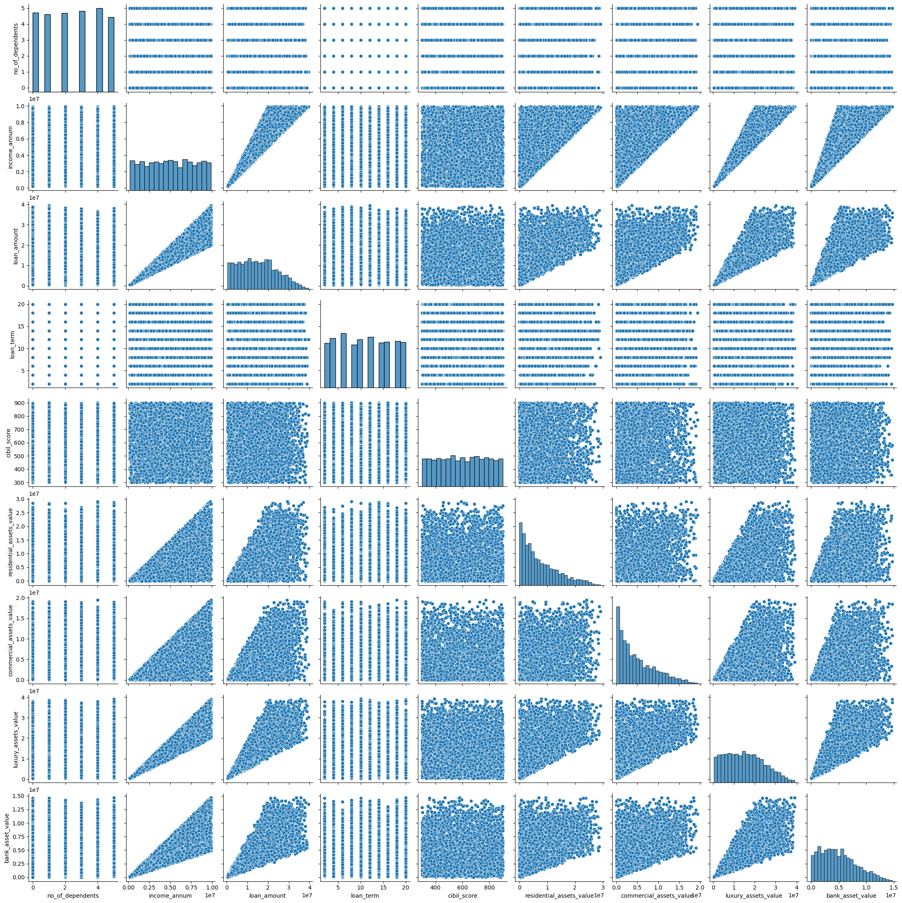
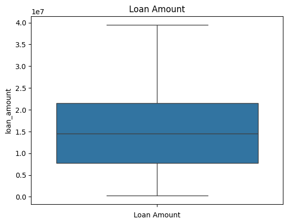
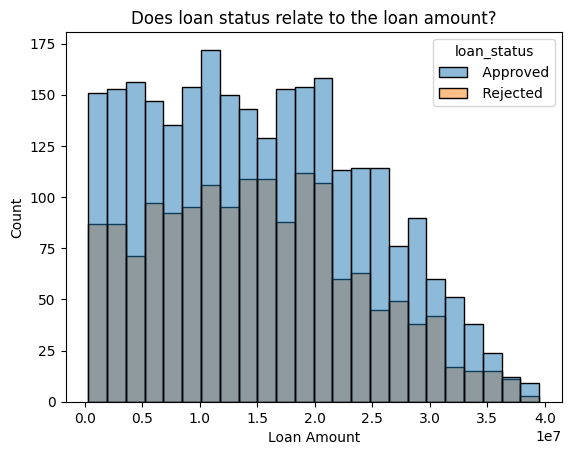
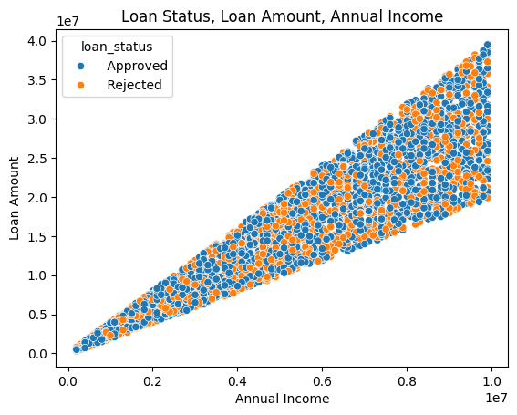
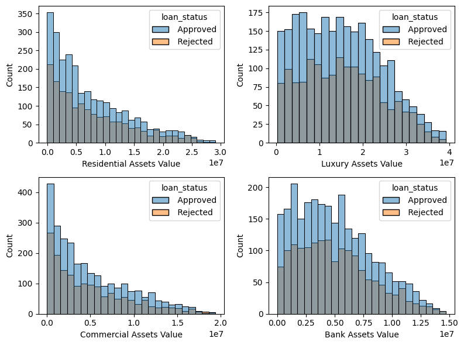
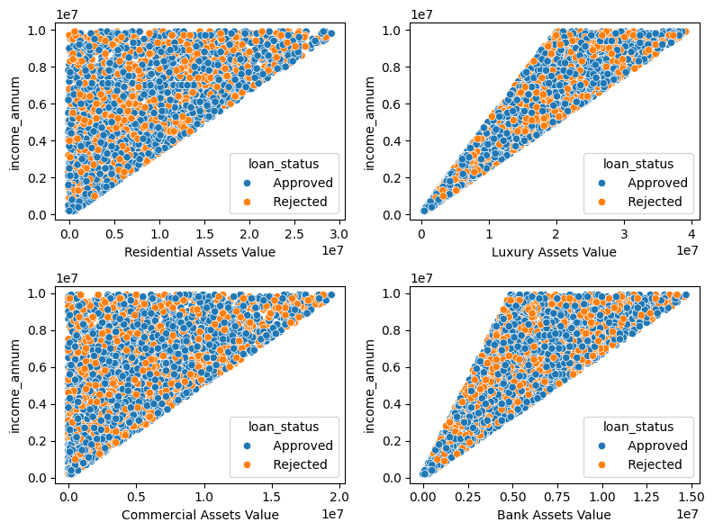
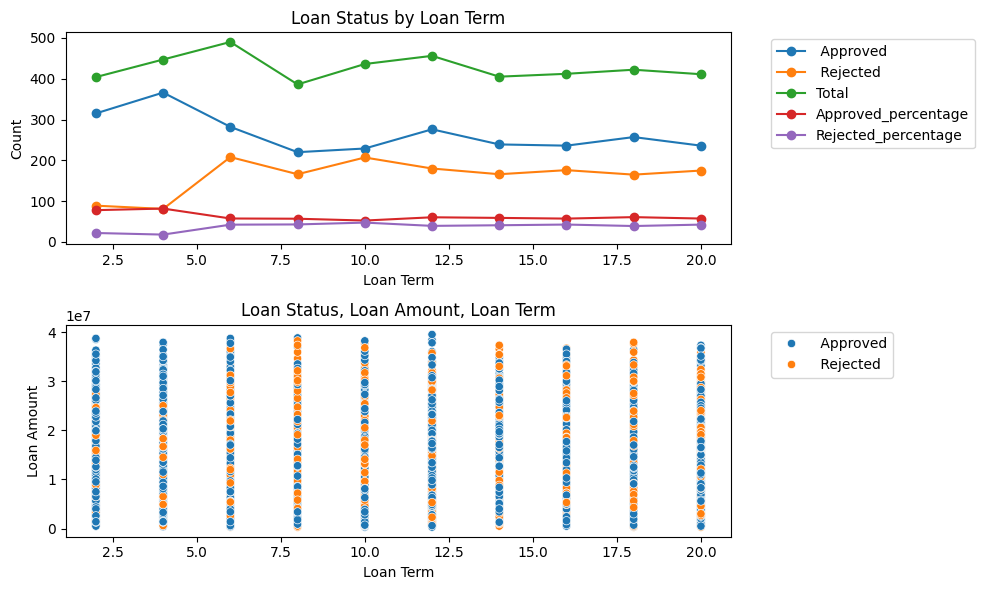
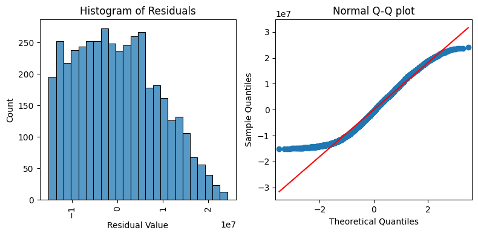
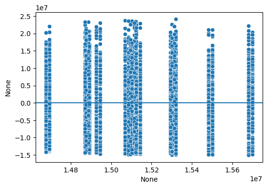

# coding_loan_system

**coding_loan_system** is a comprehensive machine learning project focused on predicting loan approvals. It includes exploratory data analysis (EDA), model training, interpretability tools, and a user-friendly demo interface. The project leverages real-world datasets to analyze key factors influencing loan approval decisions, applies advanced feature engineering and statistical tests, and provides interactive tools for both technical and non-technical users to explore model predictions. Ideal for those interested in financial analytics, machine learning interpretability, and practical deployment of predictive models.

[](https://colab.research.google.com/github/Ahmed-El-Zainy/coding_loan_system/blob/main/src/loan-prediction-eda-x-2-anova-test-rf-97.ipynb)


# Table of Contents
- [Installation](##installation)
- [Demo](##demo)
- [EDA](##EDA)
- [Statical-Tests](##Statical-Tests)
- [Training](#training)
  * [Dataset](#dataset)
- [Evaluation](#evaluation)
- [Future plans](#future-plans)
- [Team](#team)


## installation
```
git clone https://github.com/Ahmed-El-Zainy/coding_loan_system.git
```

```
pip install -r requirements.txt
```


## demo 

Running the Demo
```
python src/gradio_demo.py
```


## EDA


- As we can see, there are some variables having positive correlation with other variables, for example `loan_amount` & `income_annum`, `luxury_assets_value` & `bank_asset_value`, `income_annum` & `luxury_assets_value`. Let's start from here.


--------








- There are some interesting insights we have seen over the above figure:
1. When annual income increases, the loan amount tends to increase. But the annual income doesn't show an obvious trend with the loan status.
1. In this dataset, the applicants who have the lower annual income have a narrow range in loan amounts. Vise Versa, the applicants who have the higher lower annual income have a wider range in the loan amounts. Besides that the lenders will only accept the loan amount that aligns with the annual income in order to insure the applicants have ability to pay the loan back, it is easy to imagine the applicants who have higher annual income have more flexibility on the amount of the loan, whatever for themselves or for the lenders.
1. In this dataset, the applicants who has highest annual income has been approved when they apply for the highest loan amount (see the upper right corner of the figure), but at the same time, the applicants who have the highest annual income have chances of being rejected when they apply lower loan amount (see the middle right of the figure/lower right of the triangle). It can be caused by different lenders and other conditions of the applicants. Let's use some code to take a closer look at it.


 - I am amazed to see the credit scores around 540 - 550 separate the loan status into two parts in a very clear way. In the other words, the loan status is highly related to the credit score.
<br>
It is also interesting to see the credit score that separates the loan status is not 579 which is the highest score of the "poor" credit score. In the other words, the poor credit scores which are above 540 - 550 still have a good chance of being approved by loan lenders. This could be attributed to lenders' flexibility or specific factors that impact approval decisions.







- Let's take a more look about the asset values through the scatterplot before we move on. 

* We can see, both of `residential_assets_value`, `commercial_assets_value` create right triangles on the scatter plots, cutting the plot into two sections. This indicates that the relationship between annual income and these asset values might have some sort of threshold effect. For example, once the asset value reaches a certain point, the annual income tends to increase significantly.


* The obtuse triangles you're seeing for `luxury_assets_value`, `bank_asset_value suggest` have a different type of relationship. The smaller triangle for luxury assets value compared to bank asset value might indicate that while there's a strong correlation between luxury assets value and annual income, there's a higher variability in annual income for any given luxury assets value. In other words, luxury assets might be a good indicator of higher annual income, but there are exceptions.


------



- 1. The total observations for each of the loan terms are very even, we appreciate the owner of this dataset, so we can analyze the data much easier without worrying about the balancing.
1. The shortest loan term in this dataset, which is 2 years, gets the one of the most chances for being approved by the lenders, compared to other loan terms, except the 4 years loan term which gets the most chances for being approved.
1. When the loan term is more than 4 years, the chance of being rejected have significantly increased, vise versa, the chance of being approved have dropped. Until the loan term equals to 8, both chances of being approved and rejected are tended to be normal. When the loan term reaches the 10 years, it is a loan term whose chance of being approved and rejected are approximately the same. After 10 years, the trend is becoming more consistent and the chance of being approved is slightly higher than the chance of being rejected.
1. In the group of 2 years of loan term, the applicants who apply for loans for more than \\$30,000,000 have all been approved. Similar situation as the applicants in the group of the 4 years of loan term, who apply for more than \\$30,000,000 loan amount. Compared to the higher loan amount, the lower loan amount has more chance of being rejected, especially when the applicants want the 4 years of loan term. In my experience, short term loans with lower loan amounts should be even easier to be paid back, compared to larger amounts. What are the reasons that cause those applications to be rejected? Let's use a subset to find out the reason.


## Statical-Tests
### Chi-square Tests
- The null hypothesis for the Chi-Square test is that the two variables are independent, meaning that there's no relationship between them. If the p-value is below a chosen significance level (0.05), we would reject the null hypothesis, indicating that there is a significant association between two variables.

1. `no_of_dependents` and `loan_status`
```python
contingency_dependents = pd.crosstab(loan['no_of_dependents'], loan['loan_status'])

# Perform Chi-Square test
chi2_dependents, p_dependents, dof_dependents, expected_dependents = stats.chi2_contingency(contingency_dependents)

# Print the results
print("Chi-Square Value:", chi2_dependents)
print("p-value:", p_dependents)
print("Degrees of Freedom:", dof_dependents)
print("Expected Frequencies Table:")
print(expected_dependents)
```
result: 
```
Chi-Square Value: 2.454183890937016
p-value: 0.7833787033887646
Degrees of Freedom: 5
Expected Frequencies Table:
[[442.97774654 269.02225346]
 [433.6453502  263.3546498 ]
 [440.48910752 267.51089248]
 [452.31014289 274.68985711]
 [467.8641368  284.1358632 ]
 [418.71351605 254.28648395]]
```


- The p-value is 0.78, it indicates that there's no significant evidence to reject the null hypothesis. In other words, based on the Chi-Square test, there's no significant association between the `no_of_dependents` variable and the `loan_status` variable in the dataset.The data does not provide enough evidence to conclude that there is a meaningful relationship between the number of dependents and the loan approval status. The p-value of 0.78 suggests that any observed differences in the distribution of `no_of_dependents` between the two groups (Approved and Rejected) could very well have occurred by chance.


-----
2. `education` and `loan_status`


```python 
contingency_education = pd.crosstab(loan['education'], loan['loan_status'])

chi2_education, p_education, dof_education, expected_education = stats.chi2_contingency(contingency_education)

print("Chi-Square Value:", chi2_education)
print("p-value:", p_education)
print("Degrees of Freedom:", dof_education)
print("Expected Frequencies Table:")
print(expected_education)
```
Result: 
```
Chi-Square Value: 0.08395754138250573
p-value: 0.7720042291016309
Degrees of Freedom: 1
Expected Frequencies Table:
[[1333.91051769  810.08948231]
 [1322.08948231  802.91051769]]
```

- The p-value is 0.77, it indicates that there's no significant evidence to reject the null hypothesis. In other words, based on the Chi-Square test, there's no significant association between the `education` variable and the `loan_status` variable in the dataset.The data does not provide enough evidence to conclude that there is a meaningful relationship between education and the loan approval status. The p-value of 0.77 suggests that any observed differences in the distribution of `education` between the two groups (Approved and Rejected) could very well have occurred by chance.


----
3. `self_employed` and `loan_status`

```python 
contingency_self_employed = pd.crosstab(loan['self_employed'], loan['loan_status'])

chi2_self_employed, p_self_employed, dof_self_employed, expected_self_employed = stats.chi2_contingency(contingency_self_employed)

print("Chi-Square Value:", chi2_self_employed)
print("p-value:", p_self_employed)
print("Degrees of Freedom:", dof_self_employed)
print("Expected Frequencies Table:")
print(expected_self_employed)
```

Result: 
```
    Chi-Square Value: 0.0
    p-value: 1.0
    Degrees of Freedom: 1
    Expected Frequencies Table:
    [[1318.35652378  800.64347622]
    [1337.64347622  812.35652378]]
```

### ANOVA
- We'd like to perform a ANOVA test by using `loan_amount` (numerical) as dependent variable, and independent variables: `no_of_dependents` (categorical), `education`(categorical) and `self_employed`(categorical). We will see how the categorical variables `no_of_dependents`, `education`, and `self_employed` might collectively impact the `loan_amount` (numerical) in an ANOVA framework. This approach can help us understand whether there are statistically significant differences in `loan_amount` based on different combinations of these categorical factors.

```python
# Create subset

ols_data = loan[['loan_amount','no_of_dependents','education','self_employed']]
ols_formula = "loan_amount ~ C(no_of_dependents) + C(education) + C(self_employed)"
OLS = ols(formula = ols_formula, data = ols_data)
ols_model = OLS.fit()
```

1. Linearity

- Since `no_of_dependents`, `education`, and `self_employed` are all categorical variables, checking for linearity of the dependent variable (`loan_amount` in this case) is not as crucial as it would be when we're dealing with continuous independent variables. The main focus is on how the different categories of the categorical variables relate to variations in the dependent variable.


2. Normality 
```python
X_ols = ols_data[['no_of_dependents','education','self_employed']]
fitted_values = ols_model.predict(X_ols)
residuals = ols_model.resid

```



As we see on the left plot, the distribution of the residuals is approximately a right skewed histogram. In the Q-Q plot on the right, there is a straight diagonal line going from the bottom left to the upper right of the Q-Q plot, and the blue markers in the Q-Q plot are relatively close to the red diagonal line and not deviating significantly, it suggests that the data is approximately normally distributed. 

3. Independent observations
- Combining our previous conclusions and the correlation score in the previous section, we assume all independent variables here (`no_of_dependents`, `education`, and `self_employed`) are independent from one another.

4. Homoscedasticity



 - The data points seem to be scattered randomly across the line where residuals equal 0, the assumption is likely met.

test

```python
anova = ols(formula = ols_formula, data = ols_data).fit()

# Get the ANOVA summary
anova_summary = sm.stats.anova_lm(anova, typ = 2)

# Display the ANOVA summary
print(anova_summary)
```
output
```
                      sum_sq      df         F    PR(>F)
C(no_of_dependents)  2.747923e+14     5.0  0.671513  0.645062
C(education)         4.195183e+13     1.0  0.512591  0.474059
C(self_employed)     3.389126e+11     1.0  0.004141  0.948694
Residual             3.487321e+17  4261.0       NaN       NaN

```

* `C(no_of_dependents)`:

The p-value (0.645062) is greater than the common significance level of 0.05.
This suggests that there is no significant evidence to reject the null hypothesis, indicating that the number of dependents does not have a significant relationship with the loan amount.

* `C(education)`:

The p-value (0.474059) is also greater than 0.05.
Similar to the previous result, there's no significant evidence to suggest that education level has a significant relationship with the loan amount.

* `C(self_employed)`:

The p-value (0.948694) is way above 0.05.
Once again, there's no significant evidence to indicate that being self-employed has a significant relationship with the loan amount.
<br>
* In all three cases, the p-values are above the common threshold of 0.05, suggesting that these categorical variables are not significantly associated with the loan amount based on the ANOVA tests.


### Construct
- We are now proceeding to the construct stage, which is the step for building a machine learning model. Before we start, we need to do some extra steps to make the variables ready for the following steps.
